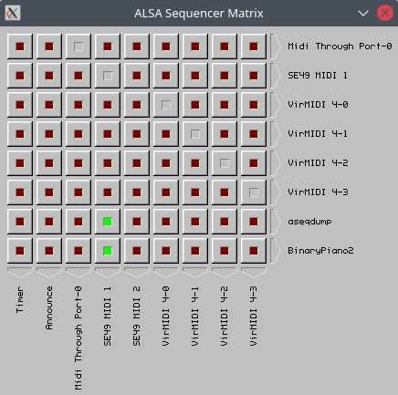

# aseqmatrix

A matrix-style patch bay for the ALSA sequencer interface.

Features:
- Single click port assignment
- MIDI feedback loop detection and resolver
- Custom bitmap-based themes

## Screenshot

